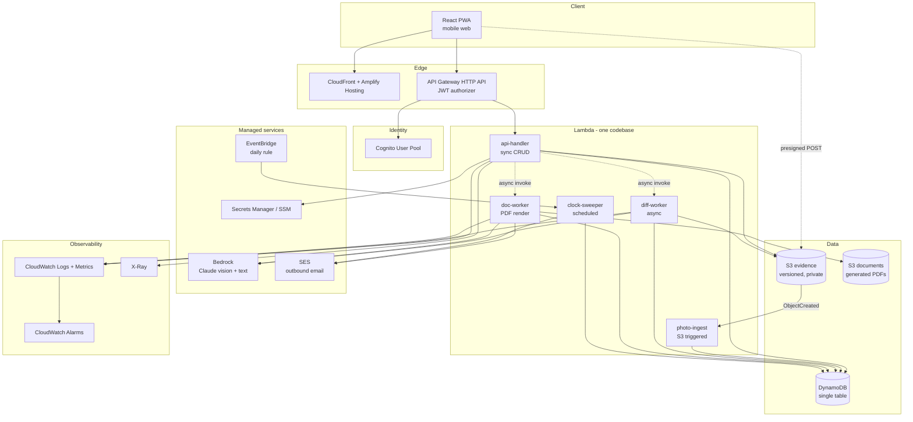
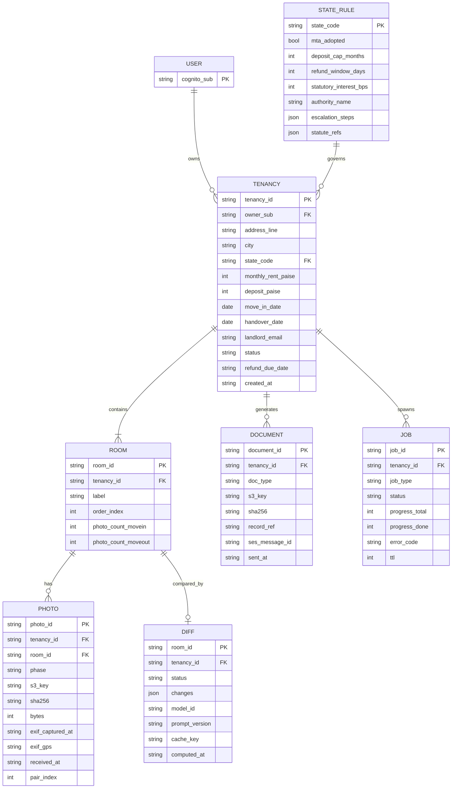
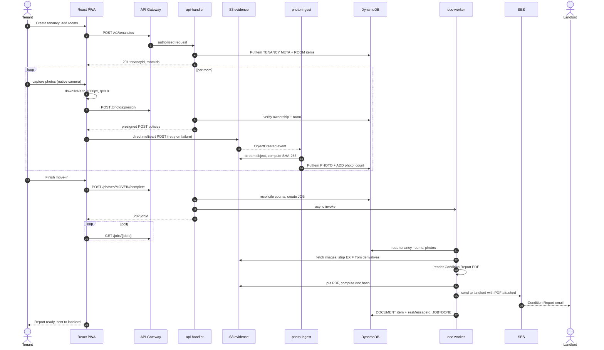
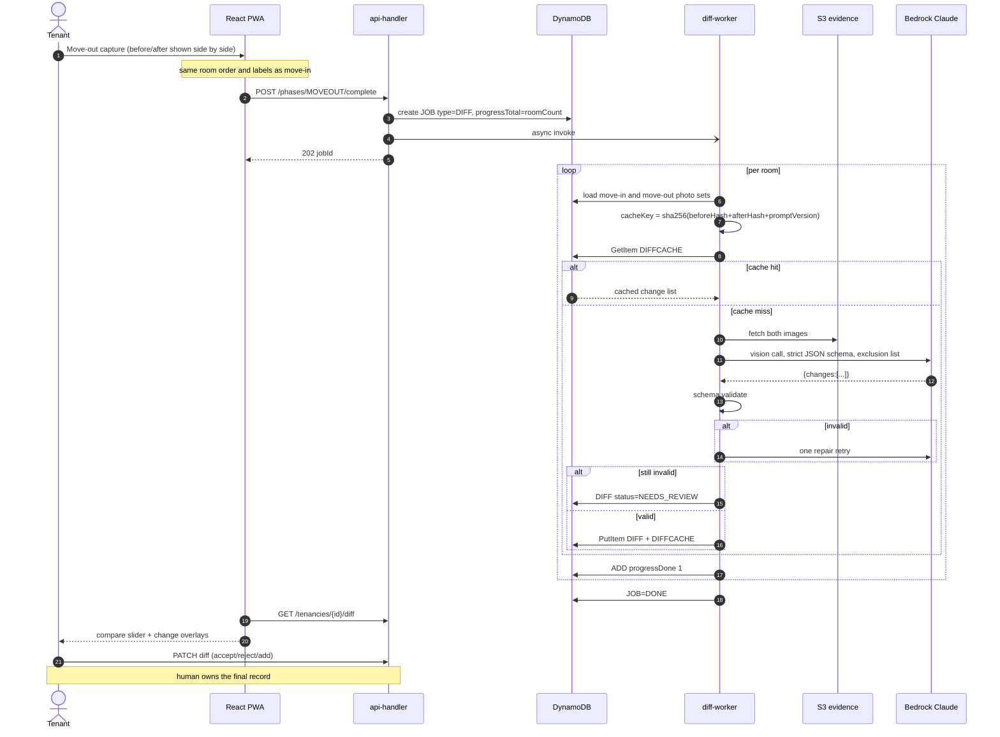
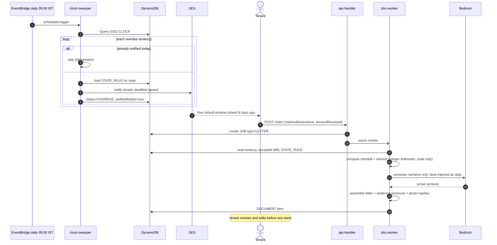
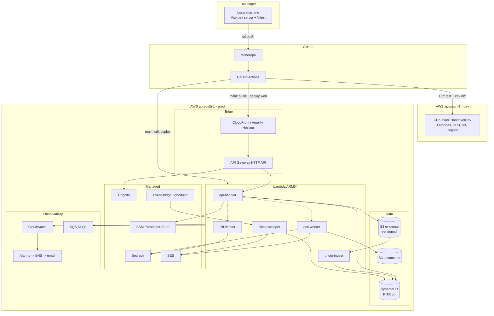

# Handover — System Architecture

**Rental security deposit evidence & claim-preparation system**

| | |
|---|---|
| Status | Design — pre-implementation |
| Region | `ap-south-1` (Mumbai) |
| Team | 2 engineers |
| MVP window | 4 days |
| Architecture style | Modular monolith, serverless deployment, event-driven |

---

## Table of Contents

1. [Executive Summary](#1-executive-summary)
2. [Requirements & Assumptions](#2-requirements--assumptions)
3. [Architecture Overview](#3-architecture-overview)
4. [System Architecture Diagram](#4-system-architecture-diagram)
5. [Component Breakdown](#5-component-breakdown)
6. [Data Architecture](#6-data-architecture)
7. [API Architecture](#7-api-architecture)
8. [Core Workflows](#8-core-workflows)
9. [AI/ML Architecture](#9-aiml-architecture)
10. [Security Architecture](#10-security-architecture)
11. [Scalability & Reliability](#11-scalability--reliability)
12. [Technology Stack & Trade-offs](#12-technology-stack--trade-offs)
13. [Deployment Architecture](#13-deployment-architecture)
14. [Repository Structure](#14-repository-structure)
15. [MVP Architecture](#15-mvp-architecture)
16. [Future Scaling Architecture](#16-future-scaling-architecture)
17. [Architecture Risks](#17-architecture-risks)
18. [Implementation Roadmap](#18-implementation-roadmap)
19. [Final Architecture Decision](#19-final-architecture-decision)

---

# 1. Executive Summary

**Handover** is an evidence-capture and claim-preparation system for rental security deposits. A tenant records the condition of a property at move-in, records it again at move-out, and the system produces a dated, tamper-evident comparison plus a state-aware demand letter if the deposit is withheld.

The architecture is shaped by one observation: **this is a write-once, read-rarely, append-only evidence ledger with asynchronous AI enrichment.** There is no hot read path, no social graph, no real-time requirement, no search corpus, and no cross-user data access. Traffic per user is two bursts of ~30 photo uploads, months apart.

That shape rules out most of the infrastructure people reflexively add. There is no cache, no message broker, no relational database, no vector store, and no microservices in the MVP. What the system actually needs is durable immutable object storage, a small key-value store, event-triggered compute, one vision model call per room pair, and a scheduler.

**Recommended architecture: a modular monolith deployed as a small set of AWS Lambda functions**, sharing one domain codebase, fronted by API Gateway, with S3 as the system of record for evidence and DynamoDB as the index and state store. Amazon Bedrock handles two bounded AI tasks. EventBridge runs the deadline clock that is, conceptually, the entire product.

This is not "serverless because serverless." Idle cost is effectively zero, the workload is genuinely event-driven, and the compute is bursty and rare — which is exactly the profile serverless is good at and exactly the profile an always-on container fleet is bad at.

The honest headline risk is not scale. It is **AI diff false positives**, which sit on the critical path of the product's core value and must be validated before anything else is built.

---

# 2. Requirements & Assumptions

## 2.1 Core problem

A rental security deposit (5–10 months' rent in some Indian markets) is held by the counterparty with no neutral custodian. The legal burden of proof for deductions sits with the landlord, but in practice the tenant loses because no dated record of property condition exists. The system's job is to create that record at a moment when the user feels no urgency, and to make it actionable months later.

## 2.2 Users and actors

| Actor | Role | System access |
|---|---|---|
| Tenant | Primary user; creates tenancy, captures evidence, generates claim | Authenticated |
| Landlord | Recipient of reports; never logs in | Email only |
| Scheduler | Non-human; drives the refund deadline clock | Internal |
| Adjudicator (Rent Authority, court, consumer forum) | Reads the exported PDF offline | None |

**Deliberate decision: the landlord is an email address, not an account.** Adding landlord accounts would double the auth surface, introduce a consent/dispute model, create a two-sided adoption problem, and add nothing to the MVP's value. The landlord's *silence* after receiving a report is itself evidentially useful.

## 2.3 Use cases (priority ordered)

| ID | Use case |
|---|---|
| UC-1 | Create tenancy record (address, rent, deposit, dates, landlord email, state) |
| UC-2 | Capture move-in condition, room by room, against a prompted checklist |
| UC-3 | Generate a Condition Report PDF and email it to the landlord, creating a timestamped paper trail |
| UC-4 | Capture move-out condition; system pairs rooms and produces a change list |
| UC-5 | Generate an Exit Report with the comparison as an annexure |
| UC-6 | Watch the refund clock; notify the tenant when the statutory/reasonable window lapses |
| UC-7 | Generate a state-aware demand letter with evidence annexure and interest computation |

## 2.4 Non-functional requirements

| ID | Requirement | Target (MVP) | Rationale |
|---|---|---|---|
| NFR-1 | Evidence immutability | Photos never mutable after write | The artifact's only value is that it can't have been edited later |
| NFR-2 | Authoritative timestamps | Server-side receipt time, never client clock | Device clocks are trivially altered |
| NFR-3 | Upload reliability on poor mobile networks | Resumable per-photo, partial progress preserved | Users capture in stairwells and basements |
| NFR-4 | Diff latency | < 60s for a 6-room comparison | Async is acceptable; user is not blocked |
| NFR-5 | Interactive API latency | p95 < 500ms | Everything slow is a background job |
| NFR-6 | Durability | 11 nines (S3 standard) | Evidence loss is total product failure |
| NFR-7 | Availability | 99.5% MVP | Not life-critical; no user is blocked by an outage |
| NFR-8 | Tenant isolation | Hard; no cross-user read path | Personal property imagery of homes |
| NFR-9 | Cost | < $5/month idle | Student-built, unfunded |
| NFR-10 | Data residency | ap-south-1 (Mumbai) | Indian users, Indian evidence |

## 2.5 Assumptions (explicit)

- **A1** Photos are captured via the device's native camera through a file input, not a custom camera stack. *(Driven by team capability; also removes a class of browser compatibility failures.)*
- **A2** Average tenancy = 6 rooms × 5 photos × 2 phases = 60 photos, ~3 MB each pre-compression, ~180 MB raw per tenancy.
- **A3** The system never asserts legal conclusions. It produces a *record* and a *draft*. Wear-and-tear judgements are advisory and labelled as such.
- **A4** Move-in and move-out are separated by months. Nothing may assume session continuity or warm state.
- **A5** State rules are a small curated dataset (3 states at MVP, ≤36 eventually), not a corpus. **No RAG is required.**
- **A6** No payment processing, no escrow, no money custody — ever. This is both a product and a regulatory decision.
- **A7** Single region. Multi-region is not justified at any plausible scale for this product.

## 2.6 Constraints

- 2 engineers, ~4 days to a demonstrable MVP.
- AWS mandatory.
- Frontend competence: React/TypeScript. No native mobile.
- Must be demonstrable live on a phone in under 3 minutes.

## 2.7 Ambiguities resolved by assumption

| Ambiguity | Resolution | Would it change the architecture? |
|---|---|---|
| Is the PDF legally admissible? | Claim *tamper-evidence*, not admissibility | No — but changes copy and risks |
| Multi-property landlords as users? | Out of scope | Yes, if added — would need org/tenant hierarchy |
| Video capture? | Out of MVP; architecture leaves room (S3 + MediaConvert) | Moderately — changes storage economics |
| Offline capture? | Out of MVP; uploads require connectivity | Yes — would require client-side queue + IndexedDB |

---

# 3. Architecture Overview

## 3.1 Candidate architectures compared

**Option A — Modular monolith on containers (ECS Fargate / App Runner) + RDS Postgres + S3.**
Familiar, excellent local dev, real SQL for future analytics, no cold starts.
*Rejected for MVP:* a container and an RDS instance run 24/7 for a workload that is idle 99.9% of the time — roughly $40–70/month to serve near-zero traffic, against NFR-9. The long-running diff work would still need to be pushed off the request thread, so you'd add a queue and a worker anyway. You'd be paying for always-on infrastructure to do intermittent work.

**Option B — Modular monolith deployed as Lambda functions, event-driven, DynamoDB + S3.**
Zero idle cost, native fit for S3-event-triggered processing, scheduler is a first-class primitive, and the async model is inherent rather than bolted on.
*Costs:* worse local development, cold starts on rarely-hit endpoints, heavier IaC burden, real vendor lock-in.
**→ Selected.**

**Option C — Amplify Gen2 full-stack (AppSync GraphQL + DynamoDB + auto-generated resolvers).**
Fastest path to a working CRUD app; auth and data wired together.
*Rejected as the primary model:* the system's centre of gravity is asynchronous background processing and document generation, not CRUD-over-a-graph. GraphQL buys little here — there is exactly one aggregate (the tenancy) and no client-driven query flexibility requirement. Amplify is retained for *hosting and auth*, where it is genuinely the least-effort correct answer.

**Option D — Microservices (capture service, diff service, document service, notification service).**
*Rejected outright.* Four services, four deployment pipelines, four failure modes, distributed tracing, and network calls — to serve a single aggregate root owned by a single team of two. There is no independent scaling need, no independent deployment need, and no team-boundary need. This would be textbook over-engineering.

## 3.2 The chosen shape

One codebase. A `domain/` layer with no AWS imports, wrapped by thin Lambda handlers. Functions are deployment units, **not** service boundaries — they share the same domain modules and the same data store, and they are versioned and deployed together. This preserves the modular-monolith property (one mental model, one refactor surface, atomic changes) while getting the operational profile of serverless.

The load-bearing decisions:

1. **S3 is the system of record for evidence.** DynamoDB holds the index and state. If DynamoDB were lost entirely, the evidence would survive; the reverse is not true. This ordering drives the backup and integrity design.
2. **All expensive work is triggered by events, never by HTTP requests.** An S3 `ObjectCreated` event begins ingestion; a phase-completion API call enqueues comparison; the client polls a job record. No request thread ever waits on Bedrock.
3. **The deadline clock is a sparse DynamoDB index scanned once daily**, not a per-tenancy scheduled task. One EventBridge rule for the whole system.
4. **Idempotency is keyed on content hashes**, which makes retries free and makes the AI spend naturally deduplicated.

## 3.3 What was deliberately not built

| Component | Why omitted |
|---|---|
| Redis / ElastiCache | There is no hot read path. Each tenancy is read by one user a handful of times over months. A cache would have a near-zero hit rate and a monthly cost. |
| SQS / SNS fan-out | S3 events and direct async Lambda invocation already provide durable decoupling with built-in retries and DLQ support. A broker adds a moving part with no current benefit. *(Introduced at V2 — see §16.)* |
| Step Functions | The workflow is: fan out over ≤8 rooms, join, render one PDF. A single Lambda under the 15-minute ceiling handles this. Step Functions earns its place when the fan-out grows or partial-failure recovery becomes complex. |
| RDS / Postgres | No joins, no ad-hoc queries, no reporting requirement. Every access is by tenancy ID. Adding a relational engine would mean paying for and operating a database to serve key-value lookups. *(Honest counterpoint in §17.)* |
| Vector DB / embeddings / RAG | The knowledge base is a 3-row rules table. Retrieval over a table you can read in full is theatre. |
| Kubernetes | No. |

---

# 4. System Architecture Diagram



**External system boundary:** the system owns everything inside `Compute` and `Data`. Bedrock, SES, Cognito and EventBridge are managed dependencies. The landlord's mail server and the tenant's browser are external and untrusted.

---

# 5. Component Breakdown

## 5.1 Frontend — React PWA

**Why it exists:** capture must happen on a phone, at the property, with no app install. A PWA served over CloudFront is installable, works on both platforms, and avoids store review entirely.

**Responsibilities:** tenancy setup; guided room checklist; camera capture via `<input type="file" capture="environment" multiple>`; client-side downscale before upload; direct-to-S3 upload with per-photo progress and retry; results view with a compare slider and change overlay; letter review and edit.

**Explicitly not responsible for:** timestamps (server-authoritative), any authorization decision, any PDF generation, any AI call.

**Key design point — client-side downscale.** Resize the long edge to ~1600px and re-encode at quality 0.8 in a canvas before upload. This cuts ~3 MB to ~350 KB, which reduces upload failures on weak networks (NFR-3), cuts storage cost ~8×, and matches the resolution the vision model actually consumes. **The original device file is not retained** — a deliberate trade-off documented in §17 (R7).

## 5.2 API Gateway (HTTP API) + Cognito JWT authorizer

**Why:** offloads JWT validation to the platform so no handler parses tokens. HTTP API rather than REST API — 70% cheaper, lower latency, and none of the REST API features (API keys, usage plans, request/response transformation) are needed.

**Interface:** all routes under `/v1`, JWT-authorized except `GET /v1/state-rules/{code}` and health.

## 5.3 `api-handler` (synchronous)

| Aspect | Detail |
|---|---|
| Responsibility | Tenancy CRUD, presigned upload issuance, phase transitions, job status, triggering async work |
| Input | API Gateway proxy events with verified JWT claims |
| Output | JSON; 202 + `jobId` for anything asynchronous |
| Dependencies | DynamoDB, S3 (presign only), Lambda (async invoke), SSM |
| Data ownership | Sole writer of `TENANCY#...#META` and `ROOM` items |
| Latency budget | p95 < 500ms; no call to Bedrock, SES, or PDF rendering is permitted here |

**Authorization is enforced here and nowhere else in the sync path:** every handler loads the tenancy and asserts `ownerSub === claims.sub` before any other logic. One shared `assertOwnership()` guard, called first in every handler, with a unit test that fails the build if a route handler omits it.

## 5.4 `photo-ingest` (S3 event triggered)

**Responsibility:** turn an opaque uploaded object into a trusted evidence record.

**Steps:** read object metadata; compute SHA-256 by streaming the object; extract EXIF (capture time, GPS, device) into structured fields; record `receivedAt` from the **server clock**; write the `PHOTO` item; increment the room's photo counter atomically.

> **Critical correction to a common assumption:** do **not** strip EXIF from the stored original. EXIF is corroborating evidence, and the original object must remain byte-identical to what its hash attests. Instead, extract EXIF into DynamoDB, and strip it only from the *derivative* image embedded into the generated PDF, which is where privacy leakage to a third party would occur.

**Why a separate function:** it runs on an S3 event, not an HTTP request; it has different IAM needs (object read, no presign); and it must be independently retryable. S3 event delivery plus Lambda's built-in retry and DLQ gives durable at-least-once ingestion with no broker.

## 5.5 `diff-worker` (async invoked)

**Responsibility:** the core value. For each room with both a move-in and a move-out photo set, produce a validated structured change list.

| Aspect | Detail |
|---|---|
| Input | `{tenancyId, jobId}` |
| Output | `DIFF#<roomId>` items + job completion |
| Dependencies | DynamoDB, S3, Bedrock |
| Timeout | 300s, memory 1024 MB |
| Idempotency | Keyed on `sha256(beforeHash + afterHash + promptVersion)`; a cached result short-circuits the model call |

**Failure policy:** per-room isolation. One room's model failure must not fail the job. Failed rooms are marked `status: NEEDS_REVIEW` and surfaced in the UI as manual-annotation slots. **A partial diff is a usable product; a failed job is not.**

## 5.6 `doc-worker` (async invoked)

**Responsibility:** render Condition Report, Exit Report, and Demand Letter to PDF; deliver via SES.

Deterministic template assembly with embedded images, hashes, timestamps, and a footer record ID. For the demand letter only, Bedrock composes narrative prose; the legal references, deadlines, authority names and interest arithmetic come from the state rules table and from code — **never from the model** (see §9.2).

**SES send is recorded with its `MessageId`** on the tenancy, both as a delivery-proof artifact and as an idempotency guard against double-sending.

## 5.7 `clock-sweeper` (EventBridge scheduled, daily)

**Responsibility:** the product's thesis, in one function. Query the sparse `GSI2` for tenancies whose refund deadline has passed without resolution; notify the tenant; advance the tenancy state.

Queries by index, never scans. Idempotent via a `lastNotifiedAt` guard, so a duplicate invocation sends nothing.

## 5.8 Storage components

| Store | Contents | Ownership |
|---|---|---|
| `s3-evidence` | Uploaded photos. Versioned, SSE-S3, all public access blocked, lifecycle to Standard-IA at 90 days | `photo-ingest` writes metadata about it; nothing ever overwrites an object |
| `s3-documents` | Generated PDFs. Versioned, private, served only via short-lived presigned GET | `doc-worker` |
| DynamoDB single table | Tenancies, rooms, photos, diffs, documents, jobs, state rules | `api-handler` and workers, partitioned by item type |

---

# 6. Data Architecture

## 6.1 Database choice

**DynamoDB, single-table.**

Every access pattern is "give me this tenancy and some subset of its children, for this owner." That is a partition-key lookup with a sort-key prefix condition — precisely DynamoDB's strength. There are no joins, no aggregations, no ad-hoc filters. On-demand billing means idle cost is zero. Point-in-time recovery is a checkbox.

*The honest trade-off:* if a future requirement demands analytics ("average deduction claimed by city"), DynamoDB is the wrong tool and you will need to stream to S3 and query with Athena. That is a known, planned migration (§16), not an oversight.

## 6.2 Access patterns → key design

| # | Access pattern | Implementation |
|---|---|---|
| AP-1 | Get tenancy metadata | `PK=TENANCY#<id>`, `SK=META` |
| AP-2 | Get full tenancy (rooms, photos, diffs) | `PK=TENANCY#<id>`, query all SK |
| AP-3 | Get one room's photos for a phase | `PK=TENANCY#<id>`, `SK begins_with PHOTO#<phase>#<roomId>#` |
| AP-4 | List a user's tenancies | GSI1: `GSI1PK=USER#<sub>`, `GSI1SK=TENANCY#<createdAt>` |
| AP-5 | Find tenancies past deadline | GSI2 (sparse): `GSI2PK=CLOCK#PENDING`, `GSI2SK=<dueDateISO>`, query `SK <= today` |
| AP-6 | Get job status | `PK=JOB#<jobId>`, `SK=META` |
| AP-7 | Get state rules | `PK=STATE#<code>`, `SK=RULES` |
| AP-8 | Idempotent diff lookup | `PK=DIFFCACHE#<hashpair>`, `SK=RESULT` |

**GSI2 is the important one.** It is sparse — `GSI2PK` is written only when a tenancy enters `AWAITING_REFUND` and deleted when it leaves. So the daily sweep reads only the handful of tenancies actually at risk, regardless of total table size. This is what keeps the clock O(pending) rather than O(all data), forever.

## 6.3 Entity model



`statutory_interest_bps` is an integer in basis points, not a decimal percent:
`600 bps = 6.00% per annum`.

## 6.4 Consistency, lifecycle, and money

**Consistency.** Strongly consistent reads for anything in the write-then-read path (create tenancy then immediately fetch it). Eventually consistent reads for GSI1 listing — a tenancy appearing in the list a second late is harmless. The only genuine race is a user completing a phase while `photo-ingest` is still writing the last photo; solved by an atomic `ADD photo_count` and a completion check that verifies counts match the client's declared upload count, retrying for up to 10 seconds before proceeding.

**Money is stored in paise as integers.** Never floats, anywhere. Interest computation is integer arithmetic with an explicit rounding rule. **Interest rates follow the same rule for the same reason:** rates are stored as integer basis points (`statutory_interest_bps`, §6.3), because a float rate multiplied into a paise amount reintroduces exactly the rounding error that integer paise exists to prevent.

**Lifecycle.**

| Data | Retention | Mechanism |
|---|---|---|
| Evidence photos | Indefinite while tenancy is active; Standard-IA at 90 days; Glacier IR at 2 years | S3 lifecycle rules |
| Generated PDFs | Same as evidence | S3 lifecycle |
| Job records | 7 days | DynamoDB TTL |
| Diff cache | 90 days | DynamoDB TTL |
| Deleted account | Not implemented — see §15.3 | Cut for the solo build; there is no `DELETED` status in `TENANCY_STATUSES` |

When account deletion is built, a 30-day delay is the right default: accidental deletion of the only evidence in an active dispute is unrecoverable, so a grace period is correct. It is not built here (§15.3).

**Caching strategy: none, by design.** The only cached thing is the diff result, cached for cost and idempotency rather than latency. CloudFront caches static frontend assets. There is no application cache because there is no repeated read of the same hot data.

---

# 7. API Architecture

Base: `/v1`. Auth: `Authorization: Bearer <Cognito ID token>` unless noted. All responses `application/json`. Errors follow RFC 7807 problem+json with a stable `code`.

### `POST /v1/tenancies`

Create a tenancy record.

- **Request:** `{ addressLine, city, stateCode, monthlyRentPaise, depositPaise, moveInDate, landlordEmail, rooms: [{label, orderIndex}] }`
- **Response 201:** `{ tenancyId, status: "MOVEIN_PENDING", rooms: [{roomId, label}] }`
- **Authz:** any authenticated user; `ownerSub` set from token claims, never from the body.
- **Validation:** `stateCode` must exist in `STATE_RULE`; `depositPaise > 0`; `landlordEmail` RFC-valid; `rooms` length 1–20.
- **Errors:** `422 UNKNOWN_STATE`, `422 INVALID_DEPOSIT`, `429 TENANCY_QUOTA` (≤10 per user per day).

### `POST /v1/tenancies/{id}/photos:presign`

Issue presigned POST policies for a batch of uploads.

- **Request:** `{ phase: "MOVEIN"|"MOVEOUT", roomId, files: [{clientRef, contentType, bytes}] }`
- **Response 200:** `{ uploads: [{clientRef, url, fields, s3Key, expiresAt}] }`
- **Authz:** owner only.
- **Validation:** `contentType` ∈ {image/jpeg, image/png, image/webp}; `bytes` ≤ 8 MB; batch ≤ 10; room belongs to tenancy; phase valid for current tenancy status.

> Presigned **POST** rather than PUT, because POST policies can enforce `content-length-range` and content-type server-side. A presigned PUT cannot bound the upload size, which is an open door for storage-cost abuse.

### `POST /v1/tenancies/{id}/phases/{phase}/complete`

Close a capture phase. For `MOVEIN`, triggers Condition Report. For `MOVEOUT`, triggers diff then Exit Report.

- **Request:** `{ declaredPhotoCount }`
- **Response 202:** `{ jobId, status: "QUEUED" }`
- **Validation:** every room has ≥1 photo for the phase; ingested count reconciles with `declaredPhotoCount` (10s bounded wait); phase not already complete (idempotent — returns the existing `jobId`).
- **Errors:** `409 PHASE_ALREADY_COMPLETE`, `409 INGEST_INCOMPLETE`, `422 EMPTY_ROOM`.

### `GET /v1/jobs/{jobId}`

Poll async progress.

- **Response:** `{ jobId, type, status, progressDone, progressTotal, resultRef?, errorCode? }`
- Polled at 2s intervals with backoff. WebSockets were considered and rejected: a 30-second job polled by one user does not justify a persistent connection tier.

### `GET /v1/tenancies/{id}`

Full aggregate: metadata, rooms, photo references with presigned GET URLs (5-minute expiry), diffs, documents.

### `GET /v1/tenancies/{id}/diff`

Room-by-room change list with before/after presigned URLs. `NEEDS_REVIEW` rooms are returned explicitly so the UI can offer manual annotation.

### `PATCH /v1/tenancies/{id}/diff/{roomId}`

Tenant corrects the machine's output — accept, reject, or add a change.

- **Request:** `{ changes: [{id, action: "ACCEPT"|"REJECT"}], additions: [{type, location, description}] }`
- **Why this endpoint is non-negotiable:** the model will be wrong sometimes, and the human must own the final record. It is also the honest answer to a judge asking "what if the AI is wrong."

### `POST /v1/tenancies/{id}/claim`

Generate the demand letter.

- **Request:** `{ claimedDeductionsPaise, deductionReasons[], amountReceivedPaise, refundReceivedDate? }`
- **Response 202:** `{ jobId }`
- **Validation:** tenancy status must be `AWAITING_REFUND` or later; handover date must be in the past.

### `POST /v1/tenancies/{id}/documents/{docId}/send`

Email a generated document to the landlord via SES.

- **Response 200:** `{ sentAt, sesMessageId }`
- **Abuse controls:** max 5 sends per tenancy per day; recipient must equal the stored `landlordEmail`; **the tenant cannot supply an arbitrary recipient at send time.** Without that constraint this endpoint is an open mail relay.

### `GET /v1/state-rules/{code}`

Public, cached at CloudFront. Powers UI copy about deadlines and caps.

**Endpoints deliberately not created:** no `/users` (Cognito owns identity), no `/photos/{id}` singleton (always fetched via the aggregate), no landlord-facing endpoints, no `/search`, no admin API in MVP.

---

# 8. Core Workflows

## 8.1 Move-in capture → Condition Report → landlord



## 8.2 Move-out → AI diff → Exit Report



## 8.3 Silent clock → demand letter



---

# 9. AI/ML Architecture

## 9.1 Models

| Task | Model | Why |
|---|---|---|
| Room condition diff | Claude Sonnet on Bedrock (vision) | Image-pair reasoning with instruction-following on exclusion rules; cheaper vision models regress badly on "ignore lighting but catch a stain" |
| Letter narrative | Claude Sonnet on Bedrock (text) | Quality matters — this is read by a landlord and possibly an adjudicator |
| Room label normalisation | No model | String matching is sufficient |

**No fine-tuning. No training. No embeddings. No vector store. No RAG.** Stated plainly because the reflex to add them is strong and none is justified: the "knowledge base" is a three-row rules table that fits entirely in a prompt.

## 9.2 The deterministic / probabilistic boundary

> This is the most important table in the document.

| Concern | Owner | Rationale |
|---|---|---|
| Timestamps, hashes, EXIF | **Code** | Evidence integrity cannot depend on a sampled distribution |
| Which rooms pair with which | **Code** | Keyed on `roomId` |
| Deposit, deduction, shortfall, interest arithmetic | **Code** | A wrong number in a legal letter is a catastrophic failure |
| Statutory references, deadlines, authority names | **Data table** | Must be auditable and updatable without touching a prompt |
| Escalation ladder for a state | **Data table** | Same |
| Detecting physical changes between two photos | **Model** | Genuinely perceptual; no algorithm available |
| Describing a change in plain language | **Model** | Natural language generation |
| Whether a change is "normal wear and tear" | **Model, advisory only** | A contested legal judgement — surfaced as "a landlord may argue X; tenants typically counter Y", never as a verdict |
| Letter prose and tone | **Model, human-reviewed** | Draft, not send |

**Nothing the model produces is sent to a third party without a human approving it.** That is a hard architectural rule, enforced by the fact that no send path is reachable without an explicit user action on a review screen.

## 9.3 Prompt layer

Prompts are **versioned artifacts in the repository**, not strings inline in handlers. `promptVersion` is written into every `DIFF` record and forms part of the cache key, so a prompt change invalidates the cache and the provenance of every past result stays inspectable.

The diff prompt has four fixed parts:

1. Role and task.
2. An explicit **exclusion list** — lighting, shadows, white balance, exposure, camera angle and distance, presence or absence of furniture, curtains, personal belongings, clutter.
3. An explicit **inclusion list** — walls, floor, ceiling, fixed fittings, fixtures, doors, windows, sanitaryware, built-in cabinetry.
4. A strict output schema with a `confidence` field per change.

Structured output is obtained via Bedrock **tool-use with a JSON schema**, not by asking for JSON in prose. Validation is Zod on the way out, one repair retry on failure, then `NEEDS_REVIEW`.

## 9.4 Context construction and cost control

| Control | Implementation | Effect |
|---|---|---|
| Image downscale | Client-side to 1600px | Largest single lever on token cost |
| Pair cap | ≤3 representative pairs per room | Bounds worst-case spend per room |
| Diff cache | `sha256(before+after+promptVersion)` | Re-runs are free; demo re-runs are instant |
| Per-tenancy budget | Hard cap on model invocations, tracked in DynamoDB | One abusive tenancy cannot generate unbounded spend |
| Rate limit | Per-user diff jobs per day | Abuse prevention |
| Bedrock alarm | CloudWatch alarm on daily invocation count | The single most likely source of a surprise bill |

Estimated cost per tenancy: ~6 rooms × 1 vision call (2 images at ~1600px) + 1 letter generation. This is cents, not dollars — but the **unbounded** case (a script creating tenancies in a loop) is dollars, which is why the per-user quota exists.

## 9.5 Evaluation

A golden set of ≥20 image pairs from real rooms, each labelled with ground-truth changes and each including at least one **distractor** (moved furniture, different time of day, open curtain, different camera distance).

Two metrics, tracked separately because they have opposite cost profiles:

- **Recall** — did it find the real change? A miss loses the user money.
- **False positive rate** — did it invent a change? **This is the metric that matters more**, because a change list full of phantoms is worse than no list: it destroys the tenant's credibility if produced in a dispute.

The eval runs as a script against the golden set and is the **day-one go/no-go gate** (§18). If FP rate is unacceptable, the fallback is tier 2/3 below.

## 9.6 Fallback strategy (three tiers)

1. **Model unavailable / throttled** — exponential backoff with jitter, then inference profile to an alternate region, then tier 2.
2. **Schema validation fails twice, or confidence below threshold** — room marked `NEEDS_REVIEW`; UI presents the pair side by side for manual annotation. The product still works; a human does the perception.
3. **AI diff globally disabled** (feature flag in SSM) — the system degrades to a pure evidence-capture product: timestamped, hashed, paired before/after sets plus a manual change list. **This is still a shippable, valuable product**, which is precisely why the AI can be treated as an enhancement rather than a dependency.

That third tier is the architectural insurance policy behind risk R1.

## 9.7 Guardrails and observability

**Guardrails:** no legal conclusions; no claims about admissibility; wear-and-tear framed as contested; every model-derived assertion in a PDF carries a visible marker distinguishing it from recorded fact; the tenant must affirmatively accept each change before it enters a letter.

**Observability:** log `promptVersion`, `modelId`, input/output token counts, latency, cache hit/miss, validation outcome, and `confidence` distribution for every invocation — correlated by `jobId`. Raw prompts and images are never written to logs. Without this you cannot debug a bad diff, and you cannot tell a cost problem from a quality problem.

---

# 10. Security Architecture

## 10.1 Threat model

The assets are private photographs of people's homes and their residential addresses. That is more sensitive than the product's mundane framing suggests, and the design treats it accordingly.

| Threat | Control |
|---|---|
| Cross-tenant data access | `assertOwnership()` in every handler; no endpoint accepts an owner ID from the client |
| Direct S3 enumeration | All public access blocked; objects reachable only via presigned URLs with ≤5 min expiry |
| Upload abuse (storage cost) | Presigned POST with `content-length-range`, content-type allowlist, per-user daily quotas |
| Mail relay abuse | Recipient is always the stored `landlordEmail`; never client-supplied at send time; send rate-limited |
| Evidence tampering | S3 versioning; deny `DeleteObjectVersion`/overwrite in bucket policy; SHA-256 at ingest; content hash printed in the PDF |
| LLM prompt injection via image content | Model output is schema-constrained and consumed only as structured data, never executed and never used to construct a request |
| Token theft | Short-lived ID tokens; refresh handled by Cognito; no tokens in `localStorage` — in-memory with refresh cookie |
| Bedrock cost attack | Per-user quotas, per-tenancy invocation cap, CloudWatch billing alarm |
| PII leakage to landlord | EXIF (incl. GPS) stripped from images embedded in outbound PDFs |

## 10.2 Auth

**Authentication:** Cognito User Pool, email + password with mandatory verification, or Google federation. No custom auth. No password handling in application code — ever.

**Session:** Cognito-issued JWT; ID token in memory, refresh token in an `HttpOnly; Secure; SameSite=Strict` cookie. Access tokens are never persisted to `localStorage`, which removes the standard XSS token-exfiltration path.

**Authorization:** single-role model (`owner`). No RBAC in MVP because there is exactly one role — adding a role system now would be speculative complexity. The ownership check is the entire authorization model and is therefore unit-tested with an explicit "every route calls the guard" assertion.

## 10.3 Encryption, secrets, validation

Encryption in transit: TLS 1.2+ everywhere; CloudFront enforces HTTPS. At rest: SSE-S3 on both buckets, DynamoDB encryption at rest (AWS-managed keys at MVP; customer-managed KMS at V2 when a compliance requirement exists to justify the key-management overhead).

Secrets: there are effectively none. IAM roles cover S3, DynamoDB, Bedrock and SES. Configuration (feature flags, model IDs, prompt version pointers) lives in SSM Parameter Store. **No secret is ever in an environment variable or in the repository.**

Input validation: Zod schemas at every handler boundary, shared with the frontend from `packages/shared` so client and server cannot drift. Reject-by-default on unknown fields. Every rupee value validated as a non-negative integer.

IAM follows least privilege per function:

- `api-handler` — `s3:PutObject` on a prefix (for presign) but **not** `s3:GetObject`
- `diff-worker` — `s3:GetObject` and `bedrock:InvokeModel`, no SES
- `doc-worker` — SES `SendRawEmail` restricted by a configuration set

## 10.4 Rate limiting

API Gateway throttling for a global ceiling; per-user application-level quotas in DynamoDB with atomic counters for the expensive operations (tenancy creation, diff jobs, document sends). Platform-level throttling alone is insufficient because the expensive operations are expensive per-call, not per-second.

## 10.5 Privacy posture

Data minimisation: no phone number, no Aadhaar, no PAN, no landlord identity beyond an email address. Users can export everything (the PDFs are the export) and delete everything (30-day grace, then purge). Region-pinned to `ap-south-1`. A plain-language line in the UI: *we never hold your money, never contact your landlord without you pressing send, and never charge for recovery.*

---

# 11. Scalability & Reliability

## 11.1 Behaviour by scale

**1K users (MVP, and the realistic ceiling for a long time).** Everything is within free tier or near it. DynamoDB on-demand, Lambda concurrency in single digits, ~180 GB of S3 if every user completes a full tenancy. No changes required. Estimated cost: single-digit dollars per month.

**10K users.** Still no architectural change. Watch two things: Lambda cold starts on `api-handler` (mitigate with 1–2 units of provisioned concurrency if p95 drifts, roughly $15/month), and Bedrock invocation volume against the account quota. S3 lifecycle to Standard-IA now pays for itself.

**100K users.** First real changes appear, and note that **none of them are the database**:

- Insert **SQS between the phase-completion API and `diff-worker`**, with a DLQ. Direct async invoke is subject to per-function concurrency limits, and a burst of end-of-month move-outs is a genuine thundering herd. This is the one component deliberately omitted at MVP and deliberately added here.
- Bedrock throughput becomes the constraint. Request a quota increase, or move to provisioned throughput if utilisation justifies it.
- Move diff fan-out to **Step Functions Distributed Map** for per-room retry and partial-failure visibility.
- DynamoDB: still fine. Partition keys are `TENANCY#<uuid>` — uniformly distributed by construction, no hot partitions possible.

**1M users.** The bottleneck is **storage economics and AI spend, not compute.** At ~180 MB per tenancy, 1M tenancies is ~180 TB. In S3 Standard that is roughly $4,000/month; aggressive lifecycle to Glacier Instant Retrieval cuts it substantially, and evidence is by definition cold after the dispute closes. Additional changes: CloudFront in front of document delivery; DynamoDB Streams → Kinesis Firehose → S3 → Athena for any analytics; multi-AZ is automatic and multi-region is still not justified.

> The scaling story is honest and slightly boring: this architecture does not need to be rewritten. It needs a queue at 100K and a storage lifecycle policy that is aggressive from day one.

## 11.2 Bottlenecks and single points of failure

| Component | SPOF? | Mitigation |
|---|---|---|
| DynamoDB table | No | Multi-AZ by default; PITR enabled |
| S3 buckets | No | 11-nines durability; versioning |
| Cognito | Yes, practically | Regional service; outage blocks login but not stored evidence |
| Bedrock | Yes, for diff | Three-tier fallback (§9.6); system degrades, does not fail |
| SES | Partial | Sends queue and retry; send failure never blocks document generation |
| Single region | Yes | Accepted. Multi-region DR for a product where nothing is lost during an outage is not a defensible cost |

## 11.3 Retries, idempotency, fault tolerance

Every async operation is idempotent by construction:

- `photo-ingest` — S3 key is the natural idempotency key; reprocessing produces an identical item.
- `diff-worker` — content-hash cache key; a replay is a cache hit, not a second model call.
- `doc-worker` — job ID guards regeneration; `sesMessageId` presence guards double-send.
- `clock-sweeper` — `lastNotifiedAt` date guard.

Retry policy: Lambda async invoke retries twice with backoff, then DLQ (SQS) with a CloudWatch alarm on depth. Bedrock calls use exponential backoff with jitter on throttling, capped at 3 attempts. No infinite retries anywhere — a poison message must surface, not spin.

**Disaster recovery.** RPO: near-zero for S3 (versioning + cross-region replication at V2), 5 minutes for DynamoDB (PITR). RTO: hours, via IaC redeploy — the entire stack is code, so recovery is `cdk deploy` plus a table restore. Critically, **evidence loss is the only unrecoverable failure**, which is why S3 versioning and a deny-delete bucket policy are MVP requirements rather than V2 niceties.

---

# 12. Technology Stack & Trade-offs

| Layer | Choice | Reason | Alternative | Trade-off accepted |
|---|---|---|---|---|
| Frontend | React 18 + TypeScript + Vite | Team competence; Vite build speed matters on a 4-day clock | Next.js | No SSR — irrelevant for an authenticated tool; loses SEO, which this product does not need |
| Styling | Tailwind | No naming overhead, fast iteration | CSS Modules | Verbose markup |
| Capture | `<input capture="environment">` | Zero API surface; works on all phones; no permission edge cases | `getUserMedia` | **Loses the live ghost overlay.** Replaced by a post-capture compare slider — deliberate risk reduction for a team new to camera APIs |
| Hosting | Amplify Hosting (CloudFront) | Git-push deploys, free TLS, PR previews | S3 + CloudFront + custom CI | Less control over cache behaviour |
| Auth | Cognito | Managed; API Gateway integrates natively; no password code | Auth0 | Worse DX, dated hosted UI. **Do not theme it** — one hour, then never touch it |
| API | API Gateway HTTP API | ~70% cheaper than REST API, lower latency, native JWT authorizer | ALB + Fargate | Loses always-warm compute |
| Compute | Lambda (Node 20, ARM64/Graviton) | Zero idle cost, event-native, ~20% cheaper on ARM | Fargate | Cold starts; harder local dev |
| Language | TypeScript throughout | One language across frontend, backend and IaC for a 2-person team | Python for workers | Python has better imaging/PDF libraries — a real loss, accepted for context-switch savings |
| Database | DynamoDB single-table, on-demand | Every access is a key lookup; zero idle cost; PITR | Postgres (RDS / Aurora Serverless v2) | **No ad-hoc queries or analytics.** Known future migration path via Streams → S3 → Athena |
| Object storage | S3, versioned | Durability is the product | — | None |
| AI | Bedrock (Claude Sonnet) | Vision + strong instruction-following; stays inside AWS IAM, no external key management | Direct Anthropic API | Bedrock region/model availability is more constrained |
| PDF | `pdf-lib` (Node) | Keeps one language; sufficient for structured reports with images | Python + ReportLab | ReportLab is materially better for complex layout — accepted because layout here is simple |
| Email | SES | Native, cheap, DKIM/SPF support | SendGrid | Sandbox mode requires production-access approval — **request on day one, it is not instant** |
| Scheduler | EventBridge Scheduler | One rule for the whole system | Cron on a container | Container would need to exist |
| IaC | AWS CDK (TypeScript) | Same language as everything else; typed constructs; no YAML | SAM / Terraform | Steeper first-hour learning curve. **Pragmatic fallback: if infra is not deployed by noon on day one, click it in the console and codify afterwards.** Shipping beats purity on a 4-day clock |
| Validation | Zod | Shared client/server schemas prevent drift | Yup / io-ts | — |
| Testing | Vitest + `aws-sdk-client-mock` | Fast; no LocalStack dependency | Jest + LocalStack | Less integration fidelity |
| Monitoring | CloudWatch Logs/Metrics/Alarms + X-Ray | Built in, zero setup | Datadog | Weaker UX; correct cost decision |

**On ARM64:** use it. It is a configuration flag, ~20% cheaper, and there are no native dependencies here that complicate it.

---

# 13. Deployment Architecture

## 13.1 Environments

Two, not three. `dev` (per-developer CDK stack, isolated by stack name suffix) and `prod`. A staging environment for a two-person team on a four-day build is process for its own sake.

## 13.2 Local development

Frontend runs against deployed dev infrastructure — no LocalStack. LocalStack fidelity problems around Bedrock, SES and presigned POST would cost more hours than they save. Lambda handlers are unit-tested with mocked AWS clients; the integration surface is exercised against real dev-account resources.

## 13.3 Deployment diagram



## 13.4 CI/CD

- **On pull request:** typecheck, lint, unit tests, `cdk diff`.
- **On merge to `main`:** `cdk deploy`, then frontend build and deploy.

Deployment is fully automated from day one — manual console deploys on a four-day clock are how teams lose an afternoon to "it worked on my machine."

## 13.5 Alarms that actually matter

Five, and only five. More than this and nobody reads any of them.

1. DLQ depth > 0 — something is failing silently.
2. Bedrock invocations > daily threshold — cost attack or runaway loop.
3. `api-handler` 5xx rate > 1% over 5 min.
4. `diff-worker` error rate > 10%.
5. AWS Budget alert at $20/month.

Logs are structured JSON with `tenancyId`, `jobId` and `userSub` on every line, retained 30 days. X-Ray on `api-handler` and `diff-worker` only — tracing everything at this scale is noise.

---

# 14. Repository Structure

A pnpm-workspace monorepo. One repo, because the shared validation schemas between frontend and backend are the single highest-value piece of code reuse in the project and splitting repos would immediately create drift.

```text
handover/
├── apps/
│   ├── web/                        # React PWA
│   │   ├── src/
│   │   │   ├── features/
│   │   │   │   ├── tenancy/        # setup form, state selection
│   │   │   │   ├── capture/        # room checklist, file input, downscale, upload
│   │   │   │   ├── compare/        # slider, change overlay, accept/reject
│   │   │   │   └── claim/          # letter review and edit
│   │   │   ├── lib/
│   │   │   │   ├── api-client.ts
│   │   │   │   ├── image-resize.ts # canvas downscale before upload
│   │   │   │   └── upload-queue.ts # retry, per-file progress
│   │   │   └── routes/
│   │   └── public/manifest.json
│   └── api/                        # ALL Lambda handlers - one deployable codebase
│       ├── src/
│       │   ├── handlers/           # thin adapters ONLY - no business logic
│       │   │   ├── http/
│       │   │   │   ├── create-tenancy.ts
│       │   │   │   ├── presign-photos.ts
│       │   │   │   ├── complete-phase.ts
│       │   │   │   ├── get-tenancy.ts
│       │   │   │   ├── get-diff.ts
│       │   │   │   ├── patch-diff.ts
│       │   │   │   ├── create-claim.ts
│       │   │   │   ├── send-document.ts
│       │   │   │   └── get-job.ts
│       │   │   ├── events/photo-ingest.ts
│       │   │   ├── async/diff-worker.ts
│       │   │   ├── async/doc-worker.ts
│       │   │   └── scheduled/clock-sweeper.ts
│       │   ├── domain/             # NO AWS IMPORTS ALLOWED HERE
│       │   │   ├── tenancy/        # state machine, invariants
│       │   │   ├── evidence/       # pairing rules, hashing contract
│       │   │   ├── diff/           # change model, merge with human edits
│       │   │   ├── claim/          # interest + shortfall arithmetic
│       │   │   └── rules/          # state rule resolution
│       │   ├── adapters/           # AWS lives here and only here
│       │   │   ├── dynamo/
│       │   │   ├── s3/
│       │   │   ├── bedrock/
│       │   │   ├── ses/
│       │   │   └── pdf/
│       │   └── prompts/
│       │       ├── v1/room-diff.md
│       │       ├── v1/letter-narrative.md
│       │       └── registry.ts     # version -> content, imported by cache key
│       └── test/
├── packages/
│   └── shared/                     # THE most important package
│       ├── schemas/                # Zod - request/response, used by web AND api
│       ├── types/
│       └── constants/              # room presets, phases, status enums
├── infra/
│   └── cdk/
│       ├── bin/handover.ts
│       └── lib/
│           ├── data-stack.ts       # DDB, S3, lifecycle, bucket policies
│           ├── auth-stack.ts       # Cognito
│           ├── api-stack.ts        # API GW, Lambdas, IAM
│           └── ops-stack.ts        # alarms, DLQs, budget
├── data/
│   └── state-rules/                # seed JSON: KA, TN, MH - reviewed by a human
├── eval/
│   ├── golden-set/                 # labelled image pairs + ground truth
│   └── run-diff-eval.ts            # the day-one go/no-go gate
├── docs/
│   ├── architecture.md
│   ├── adr/                        # 0001-dynamodb.md, 0002-no-landlord-accounts.md ...
│   └── demo-script.md
└── .github/workflows/
```

> **The `domain/` boundary is enforced, not suggested:** an ESLint `no-restricted-imports` rule fails the build if anything under `domain/` imports `@aws-sdk/*`. That single rule is what keeps this a modular monolith rather than a pile of Lambda scripts, and it is what makes the arithmetic in `domain/claim/` unit-testable without any AWS mocking at all.

---

# 15. MVP Architecture

## 15.1 Minimum viable component set

| Component | In MVP | Note |
|---|---|---|
| React PWA | ✅ | File-input capture, no custom camera |
| Cognito | ✅ | Hosted UI, unthemed |
| API Gateway HTTP API | ✅ | |
| `api-handler` | ✅ | |
| `photo-ingest` | ✅ | Hash + timestamp is the integrity story |
| `diff-worker` | ✅ | With the three-tier fallback |
| `doc-worker` | ✅ | Condition Report + Demand Letter, generated to S3 for download |
| `clock-sweeper` | ✅ | Small function, carries the entire product thesis |
| S3 ×2, versioned | ✅ | |
| DynamoDB single-table | ✅ | |
| Bedrock | ✅ | |
| SES / email delivery | ❌ | Cut for the solo build — PDFs are downloaded, not sent (§15.3) |
| CDK + GitHub Actions | ✅ | |
| 5 alarms + DLQs | ✅ | |

## 15.2 What must stay simple

- One state in the rules table (`KA`). Not three, not thirty-six — one entry is enough to prove the rules are data-driven rather than hardcoded.
- One role. No RBAC.
- Polling for job status. No WebSockets.
- One PDF template engine. Two templates: the Condition Report (parameterised by phase, so it covers the Exit Report) and the Demand Letter.
- Sequential room processing inside one `diff-worker` invocation. ≤8 rooms × ~20s is well inside a 300s timeout.

## 15.3 Explicitly not built

Landlord accounts and the two-sided consent model. Video capture. Offline capture with client-side queue. Payments or escrow of any kind. Analytics dashboards. Multi-property management. E-signature. Any integration with a Rent Authority portal. Mobile native apps. A public API. Account deletion and the 30-day evidence purge.

**Cut for the solo build, not because they are architecturally wrong** — the design below still accommodates them, and the schemas for the send path stay in `packages/shared` unimplemented:

- **SES and all email delivery**, including the SES adapter and its CDK permissions. Documents are generated as PDFs and downloaded by the user.
- **`POST /v1/tenancies/{id}/documents/{docId}/send`** (§7). Specified, not implemented.
- **Multi-state rules.** `TN` and `MH` are not seeded; only `KA` ships.
- **A separate Exit Report template.** Folded into the Condition Report template, parameterised by phase.

## 15.4 The one shortcut worth taking, and the one that is not

**Worth taking:** deploying from the console on day one if CDK is fighting you, then codifying on day four. Infrastructure-as-code is a means, not the goal.

**Not worth taking:** skipping S3 versioning and the deny-delete bucket policy. They are two lines of CDK and they are the entire basis of the product's claim to be evidence rather than a photo album. Cut anything else first.

---

# 16. Future Scaling Architecture

| Trigger | Change | Why then, not now |
|---|---|---|
| >1K diff jobs/day | Insert **SQS + DLQ** between phase-completion and `diff-worker` | Async invoke hits concurrency limits under burst; below that it is a needless moving part |
| >8 rooms/tenancy, or partial-failure debugging becomes painful | **Step Functions Distributed Map** for room fan-out | Per-room retry and visibility; unnecessary for a sequential loop |
| Any analytics requirement | **DynamoDB Streams → Firehose → S3 → Athena/Glue** | The known answer to DynamoDB's known weakness |
| Storage cost becomes material | Aggressive lifecycle to **Glacier Instant Retrieval**; consider AVIF re-encode | Evidence is cold by definition after a dispute closes |
| Multi-property landlords become users | Introduce an **organisation entity** and RBAC | A genuine model change; do not pre-build it |
| Legal weight of timestamps challenged | **RFC 3161 trusted timestamping** or a daily Merkle root anchored externally | Meaningful hardening, but only once someone has actually contested a record |
| Compliance requirement appears | **Customer-managed KMS keys**, S3 **Object Lock** in compliance mode | Object Lock is the production-grade version of the deny-delete policy; it also makes deletion genuinely impossible, which has support implications |
| p95 login latency complaints | Provisioned concurrency on `api-handler` | ~$15/month for a problem that may never appear |
| Non-English users | Bedrock-generated letters in regional languages; template i18n | Straightforward once the deterministic/probabilistic split is clean |

> The V1 → V2 path adds components; it does not replace them. No rewrite is implied at any step. That is the main justification for the MVP shape.

---

# 17. Architecture Risks

| # | Risk | Why it matters | Likelihood | Impact | Mitigation |
|---|---|---|---|---|---|
| **R1** | **AI diff false positives** — model reports changes caused by lighting, angle or moved furniture | Sits on the critical path of the core value. A change list full of phantoms is worse than none: it destroys the user's credibility in a real dispute | **High** | **Critical** | Exclusion-list prompt; confidence thresholds; golden-set eval as a **day-one go/no-go gate**; mandatory human accept/reject; three-tier fallback (§9.6) where tier 3 is still a shippable product |
| **R2** | **Diff recall failure** — model misses a real change | User loses money believing they have proof | Medium | High | Tune the threshold toward sensitivity, since a reviewed false positive costs a click while a miss costs rupees; always show the raw pair so the human can see what the machine did not |
| **R3** | **Framing drift** between move-in and move-out photos | Degrades diff quality at the input, which no prompt can fix | High | High | Show the move-in thumbnail beside the capture control with instructional copy; store `pair_index` explicitly; treat poor framing as a `NEEDS_REVIEW` trigger rather than a silent bad result |
| **R4** | **Evidence integrity is asserted, not proven** — hashes are self-generated, so a sufficiently motivated challenger could argue the operator could have manufactured them | Undermines the product's core claim if contested | Low now, High if the product matters | High | Never claim legal admissibility; claim tamper-evidence. Add RFC 3161 timestamping or external anchoring at V2 (§16) |
| **R5** | **Upload failure on weak mobile networks** — evidence captured but never stored | Silent, total data loss at the exact moment of capture | Medium | High | Per-file retry with backoff; visible per-photo status; phase completion **blocked** until the ingested count reconciles; never show "done" on a client-side assumption |
| **R6** | **SES production access not granted in time** | Blocks the entire landlord-delivery workflow, which is the point of the Condition Report | Medium | High | Request on day one; fall back to generating the PDF for the user to send from their own mail client — arguably better evidence anyway, since it comes from the tenant's own address |
| **R7** | **Original device files are discarded after client-side downscale** | A challenger could argue the stored image is not the original capture | Medium | Medium | Store the pre-resize SHA-256 computed on-device alongside the resized object; at V2, upload the original in the background when on wifi |
| **R8** | **Bedrock cost runaway** from a loop or abuse | Unfunded team; a surprise bill is an existential problem, not an inconvenience | Low | High | Per-user quotas, per-tenancy invocation cap, content-hash cache, CloudWatch alarm, AWS Budget alert |
| **R9** | **State rules table becomes stale or wrong** | The letter cites an incorrect deadline or authority, which is actively harmful to the user | Medium | High | Rules as reviewed data with a `lastReviewedAt` field surfaced in the UI; letters carry a "verify current position" line; never generate legal references from a model |
| **R10** | **Adoption timing** — the product must be used at move-in, when the user feels no pain | Not a technical risk but the one most likely to kill the product | High | High | Architectural answer: the Condition Report must be independently valuable and instantly sendable on day one. This is why `doc-worker` and SES are MVP components rather than V2 |

---

# 18. Implementation Roadmap

Calibrated to two engineers. **A** = backend/AWS, **B** = frontend.

## Phase 0 — Hour 0 to 2 (both, together)

Write the shared contract first: DynamoDB item shapes, the diff JSON schema, and the API request/response Zod schemas in `packages/shared`. **Do not change these after hour two.** With two people, renegotiating an interface on day three costs the demo.

Create the repo, the CDK skeleton, and **submit the SES production access request** before anything else.

## Phase 1 — Day 1: prove the risk, not the feature

- **A:** presigned POST → S3 → `photo-ingest` (hash, EXIF, timestamp) → DynamoDB. Then build the Bedrock diff spike against the exclusion-list prompt.
- **B:** React shell, Cognito login, tenancy form, room checklist, file-input capture, client-side downscale, upload with retry.
- **Evening, both:** shoot the real room twice with one deliberate defect. Assemble ≥10 golden pairs including distractors (moved chair, different lighting, open curtain).

> ### ⛔ GO / NO-GO — Monday night
> Run `eval/run-diff-eval.ts`. Two questions: **does it find the real change**, and **does it stay quiet on the distractors**? If the false-positive rate is unacceptable, switch to the tier-3 product — compare slider plus manual annotation — and move the AI story to the letter generator. **Decide that night.** Carrying this uncertainty into day three is how this project fails.

## Phase 2 — Day 2: the artifact

- **A:** `doc-worker` — Condition Report PDF with embedded images, hashes, record ID; SES send; `DOCUMENT` item with `sesMessageId`.
- **B:** results view, compare slider, change overlay, accept/reject interaction.
- **Evening, both, 45 minutes, laptops closed:** write the three state rule entries by hand and outline the pitch.

## Phase 3 — Day 3: the payoff, then stop

- **A:** `domain/claim` interest and shortfall arithmetic (pure functions, fully unit-tested), letter generation, `clock-sweeper` plus the GSI2 sparse index.
- **B:** claim input form, letter review and edit, the `?demo=1` seeded path.
- **20:00 — hard feature freeze.** Non-negotiable at this team size.

## Phase 4 — Day 4: reduce variance

- **Morning:** bugs only. Record a full backup screen capture of the end-to-end flow.
- **Afternoon:** architecture slide, five alarms wired, then rehearse with a timer at least six times.
- Venue wifi will fail — the `?demo=1` path and the video are the insurance.

## Post-hackathon (if it continues)

- **Week 1:** SES reputation and DKIM; real user testing with three tenants who have actually lost a deposit.
- **Weeks 2–4:** expand state rules with a qualified reviewer; add RFC 3161 timestamping; add SQS.
- **Month 2:** background original-file upload (R7); analytics pipeline.

---

# 19. Final Architecture Decision

**Handover — modular monolith, serverless deployment, event-driven evidence pipeline, single region (`ap-south-1`).**

```text
Client        React PWA (TS, Vite, Tailwind) on Amplify Hosting/CloudFront
              Native camera via file input; client-side downscale to 1600px

Edge          API Gateway HTTP API + Cognito JWT authorizer
              Presigned POST direct-to-S3 for all uploads

Compute       One TypeScript codebase, five Lambda functions (Node 20, ARM64):
                api-handler    sync CRUD, presign, phase transitions
                photo-ingest   S3-triggered: SHA-256, EXIF, server timestamp
                diff-worker    async: Bedrock vision, schema-validated, cached
                doc-worker     async: PDF render + SES delivery
                clock-sweeper  EventBridge daily: sparse GSI2 deadline query
              domain/ layer has zero AWS imports, enforced by lint rule

Data          S3 evidence bucket  — versioned, deny-delete, lifecycle to IA
              S3 documents bucket — generated PDFs
              DynamoDB single-table, on-demand, PITR
                GSI1 user -> tenancies
                GSI2 sparse: pending refund deadlines (the product's clock)

AI            Bedrock Claude Sonnet, two bounded tasks:
                (1) room-pair change detection, strict JSON, exclusion list
                (2) letter narrative only
              ALL arithmetic, dates, statutes, escalation paths = code + data table
              Cache key = sha256(before + after + promptVersion)
              Three-tier fallback; tier 3 is still a shippable product
              No RAG, no embeddings, no vector DB, no fine-tuning

Security      Cognito auth; single owner role; assertOwnership() in every handler
              No public S3; presigned URLs <= 5 min; EXIF stripped from outbound PDFs
              Per-user quotas on the expensive paths; landlord email is server-pinned

Ops           CDK (TS) + GitHub Actions; CloudWatch + X-Ray; 5 alarms; DLQs; budget alert

NOT built     Cache, message broker, Step Functions, RDS, vector DB,
              microservices, containers, landlord accounts, payments, multi-region
```

## The three decisions that define this design

1. **S3 is the system of record; DynamoDB is only an index.**
2. **All expensive work is event-triggered and content-hash-idempotent.**
3. **Every number, date and legal reference is produced by code or a reviewed data table — never by a model.**

## The one thing to validate before building anything else

The **diff false-positive rate** against a golden set of real photo pairs. On day one.
